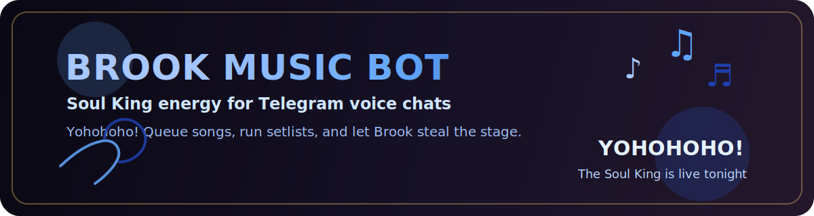
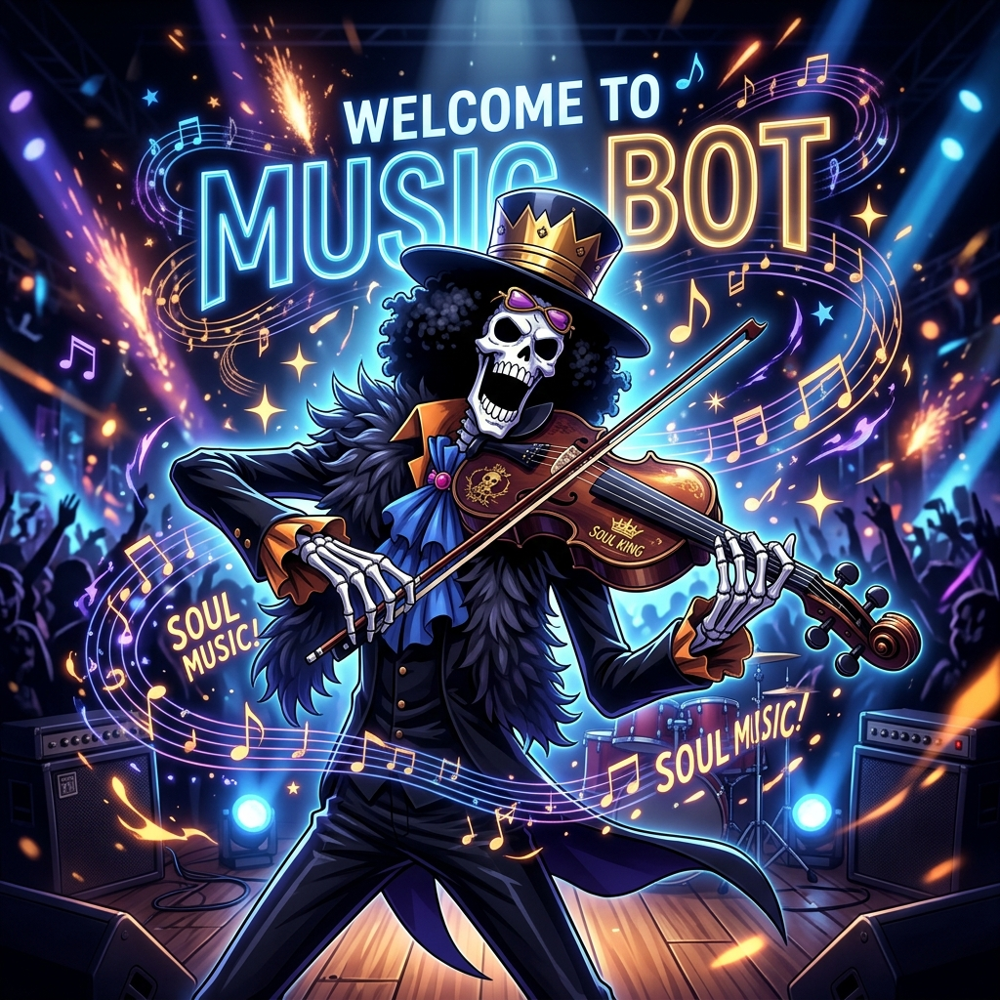

# 🎵 Brook Music Bot

<p align="center">
  
</p>

<p align="center">
  
</p>

Brook Music Bot brings a full Soul King vibe to Telegram voice chats.  
It is built around **Brook from One Piece**: stylish stage energy, playful setlist language, and a music-first group experience that feels more like a live show than a utility bot.

## Why People Like It

- Brook-themed personality across commands, queue messages, and concert prompts
- Smooth voice chat playback for groups and communities
- Mood search, saved setlists, and collaborative playlist-style flows
- Works with your own external music server, so you can decide where tracks come from
- Designed to feel lively, fun, and easy to run

## What It Does

Brook can:

- play songs into Telegram voice chats
- manage queues and encore-style looping
- search by vibe or mood
- save and replay setlists
- check whether your music server is awake and reachable

## Quick Setup

1. Clone the repo
   ```bash
   git clone https://github.com/johan-droid/Music-Bot
   cd Music-Bot
   ```

2. Install dependencies
   ```bash
   pip install -r requirements.txt
   ```

3. Copy `.env.example` to `.env`, then add your Telegram credentials, assistant session, and music server URL

4. Start the bot
   ```bash
   supervisord -n -c supervisor.conf
   ```

## Main Commands

- `/play` - start the performance
- `/queue` - see the current setlist
- `/moodsearch` - ask Brook for a mood
- `/mooddiscovery` - browse vibe picks
- `/plcreate` - create a saved setlist
- `/plplay` - replay a saved setlist
- `/serverhealth` - check the music server

## Theme

This bot leans hard into the Soul King mood:

- concert-style responses
- Brook-inspired stage language
- setlists instead of plain playlists
- a more playful group music experience overall

## Notes

- The bot expects a separate music server URL in `MUSIC_MICROSERVICE_URL`
- `docker-compose.yml` is set up for the bot itself, not a bundled music backend
- The docs in this repo now match the current client-bot stage of the project:
  - [System Design Specification](SYSTEM_DESIGN_SPECIFICATION.md)
  - [Operational Engineering Guide](OPERATIONAL_ENGINEERING_GUIDE.md)
  - [Research & Performance Analysis](RESEARCH_AND_PERFORMANCE_ANALYSIS.md)
- There is also a more detailed `.env.example` now, so users can follow the setup step by step instead of guessing env names

---
*Yohohoho! Built for crews who like their music bots with a little more soul.*
